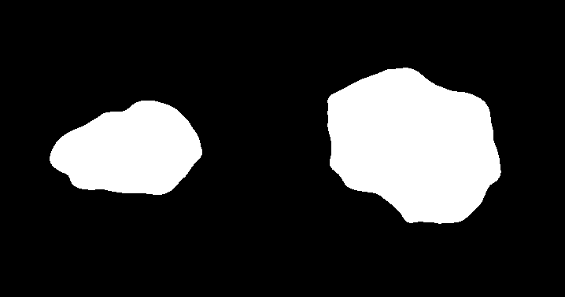
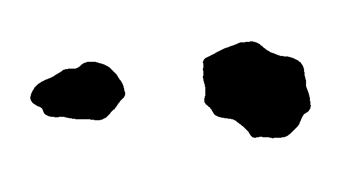

  

# Chroma Keying Application

Implementation of an algorithm for green screen matting or chroma keying from scratch. This technique is routinely used in the movie and television industry to replace the background of the actor, newscaster, or weatherman.

A video or live feed of a subject (actor) is shot in front of a solid green screen. Based on the color, the green screen is removed with an interesting background in post production or in real time.

The idea of Chroma-Keying on Green Screening matting has been around for several decades. The techniques were refined in the mid 1960s.

In the early days, a blue screen was used. However, for chorma-keying to work, the subject had to wear clothes that were not close to the color of the background.

Blue colored clothes were much more common than green colored ones, and often the newscasters in the TV industry forgot to not wear blue. So, the industry quickly moved to green screens in stead.

# Description

__Input:__ The input to the algorithm will be a video with a subject in front of a green screen.

__Output:__ The output should be another video where the green background is replaced with an interesting background of your choice. The new background could even be a video if you want to make it interesting.

__Controls:__

1. Select different patches from an image, by clicking on it. This creates a mouse event that takes the color of that patch and stores it in a list. Do this for many regions of the image where you visually see changes in color tones. Press enter to enter the next menu and a mean is calculated for all the patches listed.

  

2. Four control Bars with the current frame of the video are displayed along a Mask (so, we can see results in real time). Adjust them in order to filter the objects that we care about.

  
  

    By moving H, S and V trackbar you will get different results

  
  

    Apply some blurring to the image so that the mask gets rid of tiny dot around the main object
    **Note:** Try to adjust HSV values first, and then the blurring (this last one is for fine adjustment)

  
  

Press escape to display the filtered image with its results, we will get 5 windows with the following descriptions:

1. Image background: we get this by multiplying the mask_inv to the original image

  
  

2. Image forgreound: multiply the mask with the original image

  
  

3. Mask
4. Inverted Mask
5. Results: addition of both foreground and background

  

Press escape to get the video with the foreground and the moving objects

  

